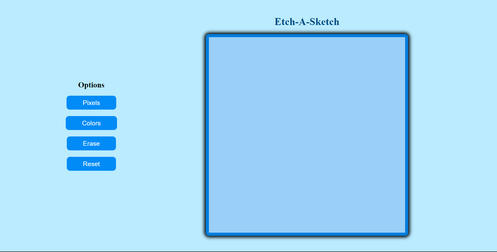

# Etch-a-Sketch

A browser-based sketchpad that allows users to draw by hovering over a dynamic grid. This project focuses heavily on **DOM Manipulation** and **Event Listeners**.

---

  

## 🚀 Live Demo
[Try the Sketchpad Here](https://codamee.github.io/etch-a-sketch/)

## 🎨 Key Features
* **Dynamic Grid Generation:** A grid built entirely via JavaScript. Users can resize the grid (up to 100x100) via a popup prompt.
* **Interactive Drawing:** Implemented "hover" functionality using mouse event listeners to change div background colors.
* **Responsive Square Sizing:** Used Flexbox to ensure that no matter the grid size (16x16 or 64x64), the drawing area stays within a fixed 960px container.

## 🛠️ Technical Skills
* **DOM Manipulation:** Creating, appending, and removing elements using `document.createElement()` and `appendChild()`.
* **Events:** Handling `mouseenter` and `click` events to drive user interaction.
* **CSS Flexbox:** Managing complex layouts without using CSS Grid.

---
*Built as part of The Odin Project Foundations.*
